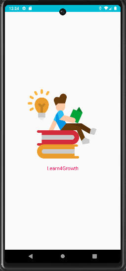

# Learn4Growth Android Application

Welcome to Learn4Growth, a collaborative learning application designed by like-minded peers to address the challenges faced by students when searching for answers to their questions. Our innovative Android application revolutionizes the learning experience by providing quick and accurate answers right at your fingertips.

## Features

### Instant Answers with QR Code Scanning
Learn4Growth streamlines the process of finding answers. With a simple QR code scan, students can access perfect answers to their questions instantly. No more tedious searching or flipping through textbooks.

### Enhance Understanding with the "Don't Understand" Button
We understand that some concepts can be challenging to grasp. That's why we've added a special feature—the "Don't Understand" button. If a student finds an answer difficult to comprehend, they can click the "Don't Understand" button to access a comprehensive video explanation, supporting their journey toward mastery.

### Queuing of Video Explanations
To foster a deeper understanding, Learn4Growth allows students to queue video explanations. If multiple questions require further clarification, the application intelligently queues the video explanations, ensuring a seamless learning experience without interruptions.

## Getting Started

To get started with Learn4Growth, follow these simple steps:

1. **Install the Application**: Download and install the Learn4Growth Android application on your device from the apk.

2. **Scan QR Codes**: When you encounter a question, launch the Learn4Growth app and scan the associated QR code. The perfect answer will appear instantly, making learning efficient and hassle-free.

3. **Utilize the "Don't Understand" Feature**: If you encounter any challenging answers, click the "Don't Understand" button to access an in-depth video explanation, supporting your journey toward mastery. The application intelligently queues video explanations for a seamless learning experience.

## Contributing

Learn4Growth is an open-source project, and we welcome contributions from the community. If you wish to contribute to the development of the application, please review the guidelines in CONTRIBUTING.md.

## Contact

For any inquiries or feedback, please contact [Project Admin](mailto:nischal200216@gmail.com).

Let's learn together for growth and knowledge!
